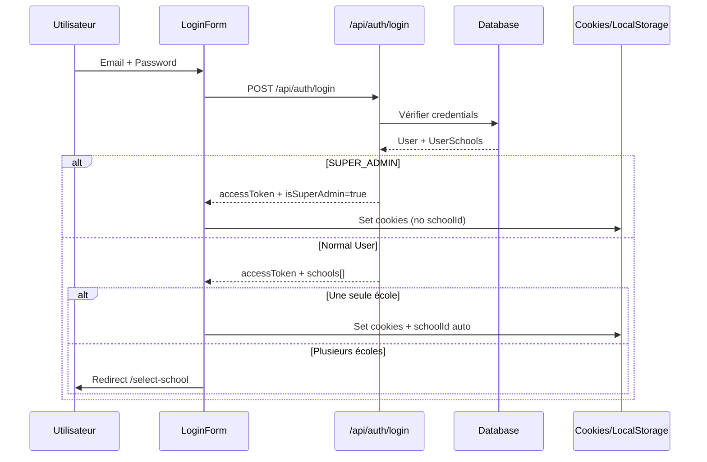
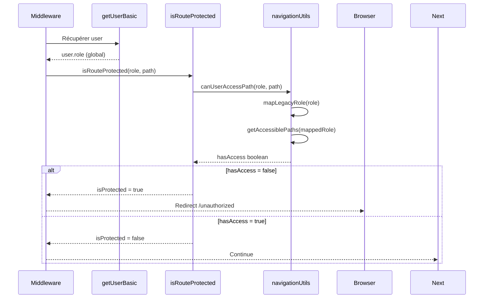

# Analyse Fonctionnelle Complète - Système Multi-Tenant

## 🌊 **Flux d'Authentification et Navigation**

### **1. Connexion Utilisateur**



### **2. Chargement de la Navigation**

```mermaid
sequenceDiagram
    participant H as useNavigation Hook
    participant GP as getProfile
    participant API as /api/profile
    parameter SN as schoolNavigation
    participant LS as localStorage

    H->>GP: getProfile()
    GP->>API: GET /api/profile + x-school-id
    API-->>GP: user + schools[] + isSuperAdmin
    
    alt SUPER_ADMIN
        GP-->>H: isSuperAdmin=true, schools=[]
        H->>LS: removeItem('schoolId')
        H->>SN: filterByRole('SUPER_ADMIN')
    else Normal User
        GP-->>H: schools=[...], selectedSchoolId
        H->>LS: getItem('schoolId')
        H->>SN: filterByRole(schoolRole)
    end
    
    H-->>UI: Navigation filtrée
```

### **3. Protection des Routes**



## 🔧 **Architecture des Composants**

### **Couche de Données**
```
┌─────────────────┐    ┌─────────────────┐    ┌─────────────────┐
│   Prisma DB     │    │   User          │    │   UserSchool    │
│                 │────│   - role (glob) │────│   - role (école)│
│   - School      │    │   - id          │    │   - schoolId    │
│   - UserSchool  │    │   - email       │    │   - userId      │
└─────────────────┘    └─────────────────┘    └─────────────────┘
```

### **Couche Actions**
```
┌─────────────────┐    ┌─────────────────┐    ┌─────────────────┐
│   getUserProfile│    │   getProfile    │    │   getUserBasic  │
│   (unifié)      │    │   (legacy)      │    │   (middleware)  │
│                 │    │                 │    │                 │
│   + user        │    │   + user        │    │   + user        │
│   + schools     │    │   + schools     │    │   - schools     │
│   + cache       │    │   - cache       │    │   + cache       │
└─────────────────┘    └─────────────────┘    └─────────────────┘
```

### **Couche Navigation**
```
┌─────────────────┐    ┌─────────────────┐    ┌─────────────────┐
│schoolNavigation │    │useNavigation    │    │navigationUtils  │
│                 │    │                 │    │                 │
│ Config centrée  │────│ Hook client     │────│ Utils serveur   │
│ + Rôles         │    │ + État          │    │ + Validation    │
│ + Groupes       │    │ + Filtrage      │    │ + Mapping       │
└─────────────────┘    └─────────────────┘    └─────────────────┘
```

### **Couche Protection**
```
┌─────────────────┐    ┌─────────────────┐    ┌─────────────────┐
│   Middleware    │    │isRouteProtected │    │   RouteGuard    │
│                 │    │                 │    │                 │
│ Protection glob │────│ Logique métier  │────│ Protection UI   │
│ + Redirection   │    │ + Mapping       │    │ + UX            │
│ + Performance   │    │ + Validation    │    │ + Feedback      │
└─────────────────┘    └─────────────────┘    └─────────────────┘
```

## ✅ **Points Forts du Système**

### **1. Multi-Tenancy Robuste**
- ✅ Isolation des données par `schoolId`
- ✅ Rôles différents par école
- ✅ SUPER_ADMIN avec accès global
- ✅ Validation contextuelle

### **2. Sécurité Multicouche**
- ✅ Middleware côté serveur
- ✅ RouteGuard côté client  
- ✅ ACL granulaire par endpoint
- ✅ Tokens httpOnly + refresh

### **3. UX Optimisée**
- ✅ Auto-sélection école unique
- ✅ Sélecteur d'école pour multi-écoles
- ✅ Navigation adaptée au rôle
- ✅ Branding dynamique par école

### **4. Performance**
- ✅ Cache avec React.cache()
- ✅ Filtrage côté client
- ✅ Middleware léger
- ✅ Tokens persistants

## ⚠️ **Points d'Amélioration Identifiés**

### **1. Duplication d'Actions**
- ❌ getUser vs getProfile vs getUserProfile
- 🔧 **Solution:** Migrer vers `getUserProfile` unifié

### **2. Mapping Legacy**
- ❌ Rôle `USER` encore présent
- 🔧 **Solution:** Migration complète + suppression

### **3. Logs de Debug**
- ❌ Logs en production
- 🔧 **Solution:** Environnement conditionnel

### **4. Middleware Basique**
- ❌ Pas d'accès au rôle école-spécifique
- 🔧 **Solution:** Utiliser `getUserProfile` dans middleware

## 🚀 **Recommandations d'Amélioration**

### **Phase 1: Nettoyage**
1. ✅ Supprimer rôle `USER` du schema
2. ✅ Migrer vers `getUserProfile`
3. 🔄 Supprimer logs de debug
4. 🔄 Marquer `getProfile` comme deprecated

### **Phase 2: Optimisation**
1. 🔄 Cache navigation côté client
2. 🔄 Middleware avec rôle école-spécifique
3. 🔄 Preload des données école
4. 🔄 Compression des tokens

### **Phase 3: Monitoring**
1. 🔄 Audit logs des accès
2. 🔄 Métriques de performance
3. 🔄 Alerts sécurité
4. 🔄 Dashboard admin

## 📊 **Métriques de Qualité**

| Critère | Score | Status |
|---------|-------|--------|
| **Sécurité** | 9/10 | ✅ Excellent |
| **Performance** | 8/10 | ✅ Très Bon |
| **Maintenabilité** | 7/10 | 🟡 Bon |
| **Scalabilité** | 9/10 | ✅ Excellent |
| **UX** | 8/10 | ✅ Très Bon |

## 🎯 **Conclusion**

Le système est **robuste et fonctionnel** avec une architecture multi-tenant solide. Les améliorations identifiées sont principalement des optimisations et du nettoyage, pas des corrections critiques.

**Priorités:**
1. 🔥 Nettoyage des actions dupliquées
2. 🔥 Suppression complète de `USER`
3. 🟡 Optimisations de performance
4. 🟡 Monitoring et observabilité
